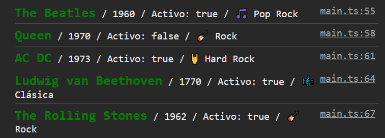

# BootcampJS - Módulo 3

En este laboratorio, he creado una _`interface`_ llamada **GrupoMusical** en la que defino las propiedades de un grupo base.

Después he generado cuatro variables para guardar los géneros musicales.

También he generado una variable llamada `styleNombre` para el estilo del nombre del grupo.

Una vez hecho lo anterior, he creado una variable por grupo en la que llama a la _`interface`_ `GrupoMusical` para saber si el valor de cada propiedad del objeto, es correcto. En este caso no he tenido ningún problema porque todo corresponde.

El `console.log` que he escrito para que tenga el resultado en consola deseado es:

`` console.log(`%c${grupo1.nombreGrupo}`, styleNombre, `/ ${grupo1.añoFundacion} / Activo: ${grupo1.activo} / ${grupo1.generoMusical}`); ``

Teniendo como resultado del primer grupo:

